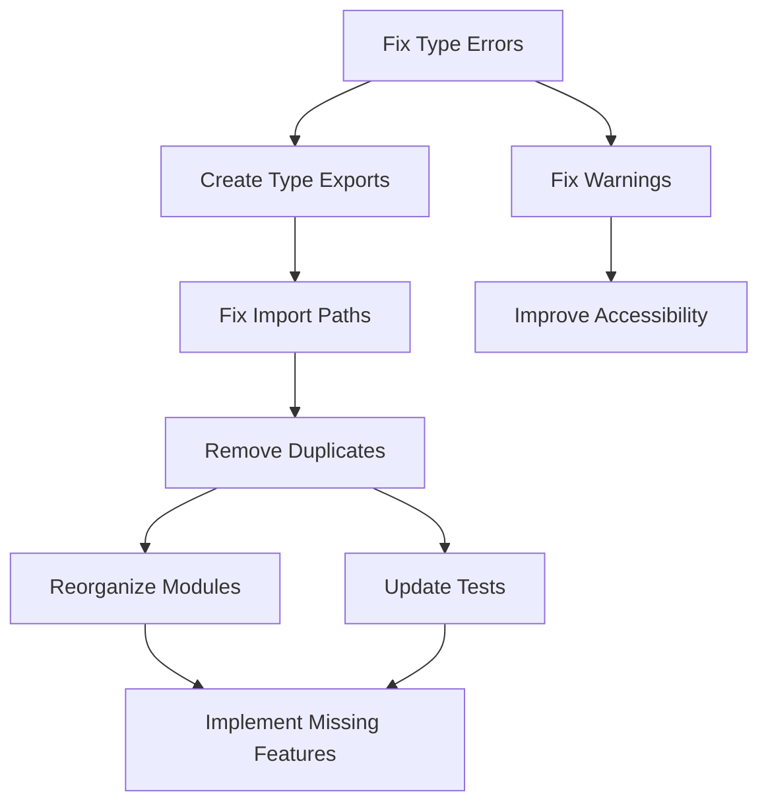

# QDesigner Modern - Codebase Analysis and Fix Plan

## Executive Summary

This document provides a comprehensive analysis of the QDesigner Modern codebase, identifying all remaining TypeScript errors, architectural inconsistencies, and missing implementations. It serves as a roadmap for completing the development work.

## 1. TypeScript Errors Summary

### 1.1 Type Errors (55 total errors found)

#### Critical Type Errors

1. **MatrixQuestion.svelte**
   - Line 19: Parameter 'row' implicitly has an 'any' type
   - Line 132: Cannot find name 'mobile' (should be 'isMobile')
   - Line 132: Arithmetic operation type error

2. **Import Resolution Errors**
   - Multiple files importing from `$lib/types/questionnaire` which doesn't exist
   - Should import from `$lib/shared/types/questionnaire` or `$lib/questionnaire/types/questionnaire`

3. **Event Handler Errors**
   - `/routes/invite/[token]/+page.svelte`: Line 216 - Directive value syntax error

### 1.2 Svelte Warnings (327 warnings)

1. **Self-closing tag warnings** (most common)
   - `<span />` should be `<span></span>`
   - `<div />` should be `<div></div>`
   - `<textarea />` should be `<textarea></textarea>`
   - `<canvas />` should be `<canvas></canvas>`

2. **Accessibility warnings**
   - Missing aria-labels on interactive elements
   - Click events without keyboard handlers
   - Buttons without text or aria-label

3. **CSS warnings**
   - Unused selectors
   - Missing vendor prefixes

## 2. Architectural Issues

### 2.1 Duplicate Implementations

#### Variable Engine (3 duplicate implementations)
```
src/lib/core/scripting/VariableEngine.ts
src/lib/scripting-engine/VariableEngine.ts
src/lib/questionnaire/variables/VariableEngine.ts
```
**Resolution**: Consolidate into single implementation at `src/lib/scripting-engine/VariableEngine.ts`

#### WebGL Renderer (2 duplicate implementations)
```
src/lib/renderer/WebGLRenderer.ts
src/lib/core/renderer/WebGLRenderer.ts
```
**Resolution**: Keep `src/lib/renderer/WebGLRenderer.ts` as the primary implementation

#### Designer Store (2 duplicate implementations)
```
src/lib/features/designer/stores/designerStore.ts
src/lib/stores/designerStore.ts
```
**Resolution**: Use `src/lib/features/designer/stores/designerStore.ts` following feature-based structure

#### Questionnaire Types (2 similar implementations)
```
src/lib/shared/types/questionnaire.ts (includes organizationId, projectId, code)
src/lib/questionnaire/types/questionnaire.ts (simpler version)
```
**Resolution**: Use `src/lib/shared/types/questionnaire.ts` as the canonical version

### 2.2 Missing Type Definitions

1. **QuestionnaireDefinition**
   - Referenced in multiple files but not defined
   - Should either alias to `Questionnaire` or be created separately

2. **Missing exports in $lib/types**
   - Files expect `questionnaire.ts` in `$lib/types` but it's in `$lib/shared/types`

### 2.3 Inconsistent Module Structure

1. **Runtime module structure**
   ```
   src/lib/runtime/
   ├── core/           # Has QuestionPresenter, QuestionnaireRuntime
   ├── renderers/      # Has specific renderers but missing WebGLRenderer
   └── stimuli/        # Stimulus-related code
   ```

2. **Scattered implementations**
   - Question components in multiple locations
   - Services split between `lib/services` and feature-specific folders

## 3. Missing Implementations

### 3.1 Missing Question Types

Based on the types defined but not implemented:
- RankingQuestion component
- FileUploadQuestion component
- DrawingQuestion component

### 3.2 Missing Runtime Components

1. **WebGLRenderer integration**
   - Not connected to runtime renderers
   - Missing from `src/lib/runtime/renderers/`

2. **Questionnaire Definition Runtime**
   - `QuestionnaireDefinition` type not defined
   - Runtime expects this for initialization

### 3.3 Missing Services

1. **Offline sync service**
   - Referenced but not fully implemented
   - Needs IndexedDB integration completion

2. **Real-time collaboration**
   - WebSocket connections referenced but not implemented

## 4. Import/Module Issues

### 4.1 Incorrect Import Paths

```typescript
// Current (incorrect)
import type { QuestionnaireDefinition } from '$lib/types/questionnaire';

// Should be
import type { Questionnaire } from '$lib/shared/types/questionnaire';
// OR create QuestionnaireDefinition type
```

### 4.2 Missing Type Exports

Create `src/lib/types/index.ts` to re-export commonly used types:
```typescript
export * from '$lib/shared/types/questionnaire';
export * from '$lib/types/dashboard';
export * from '$lib/types/response';
export * from '$lib/types/session';
export * from '$lib/types/renderer';
```

## 5. Proposed Solutions

### 5.1 Quick Fixes (Phase 1)

1. **Fix type errors in MatrixQuestion.svelte**
   ```typescript
   // Line 19 - Add proper typing
   question.config.rows.forEach((row: MatrixRow) => {
   
   // Line 132 - Fix variable name
   <div class="matrix-container" class:mobile-layout={isMobile && mobileLayout}>
   ```

2. **Fix self-closing tags**
   - Use search and replace across codebase
   - Pattern: `<(span|div|textarea|canvas)([^>]*?)/>` → `<$1$2></$1>`

3. **Create missing type alias**
   ```typescript
   // In src/lib/shared/types/questionnaire.ts
   export type QuestionnaireDefinition = Questionnaire;
   ```

### 5.2 Structural Fixes (Phase 2)

1. **Consolidate duplicate implementations**
   - Delete duplicate files
   - Update all imports to use canonical versions
   - Run tests to ensure nothing breaks

2. **Create proper type export structure**
   ```
   src/lib/types/
   ├── index.ts         # Re-exports all types
   ├── dashboard.ts     # Dashboard-specific types
   ├── response.ts      # Response data types
   ├── session.ts       # Session management types
   └── renderer.ts      # Renderer types
   ```

3. **Fix module structure**
   ```
   src/lib/
   ├── components/      # Shared UI components
   ├── features/        # Feature-based modules
   │   ├── designer/
   │   ├── fillout/
   │   └── admin/
   ├── runtime/         # Runtime engine
   ├── scripting-engine/# Variable engine (single source)
   ├── renderer/        # WebGL renderer (single source)
   └── shared/          # Shared types and utilities
   ```

### 5.3 Feature Completion (Phase 3)

1. **Implement missing question types**
   - Create component files
   - Add to question registry
   - Implement runtime handlers

2. **Complete offline sync**
   - Finish IndexedDB service
   - Implement sync queue
   - Add conflict resolution

3. **Add WebGL renderer to runtime**
   - Create adapter for runtime integration
   - Implement stimulus rendering pipeline

## 6. Implementation Order

### Priority 1 - Type Safety (1-2 hours)
1. Fix TypeScript errors in MatrixQuestion.svelte
2. Create QuestionnaireDefinition type alias
3. Fix import paths for questionnaire types
4. Create src/lib/types/index.ts with proper exports

### Priority 2 - Code Quality (2-3 hours)
1. Fix all self-closing tag warnings
2. Add missing aria-labels
3. Fix CSS warnings
4. Remove duplicate implementations

### Priority 3 - Architecture (3-4 hours)
1. Consolidate Variable Engine implementations
2. Consolidate WebGL Renderer implementations
3. Consolidate designer store implementations
4. Reorganize module structure

### Priority 4 - Feature Completion (4-6 hours)
1. Implement missing question types
2. Complete offline sync service
3. Integrate WebGL renderer with runtime
4. Add missing runtime components

## 7. Dependencies Between Fixes



## 8. Testing Strategy

1. **After each phase:**
   - Run `pnpm check` to verify type safety
   - Run `pnpm test` to ensure functionality
   - Run `pnpm lint` to check code quality

2. **Integration testing:**
   - Test questionnaire creation flow
   - Test runtime execution
   - Test offline capabilities

3. **Performance testing:**
   - Verify WebGL renderer performance
   - Check variable engine calculation speed
   - Test with large questionnaires

## 9. Code Examples

### Example 1: Fixing MatrixQuestion Type Error

```typescript
// Before
question.config.rows.forEach(row => {
  if (!(row.id in value)) {
    value[row.id] = {};
  }
});

// After
import type { MatrixRow } from '$lib/shared/types/questions';

question.config.rows.forEach((row: MatrixRow) => {
  if (!(row.id in value)) {
    value[row.id] = {};
  }
});
```

### Example 2: Creating Type Export Index

```typescript
// src/lib/types/index.ts
// Central type export file for clean imports

// Re-export questionnaire types
export type {
  Questionnaire,
  Questionnaire as QuestionnaireDefinition, // Alias for compatibility
  Question,
  Variable,
  Page,
  FlowControl,
  QuestionnaireSettings
} from '$lib/shared/types/questionnaire';

// Re-export question types
export type {
  QuestionType,
  BaseQuestion,
  TextInputQuestion,
  MultipleChoiceQuestion,
  ScaleQuestion,
  MatrixQuestion,
  MatrixRow,
  MatrixColumn
} from '$lib/shared/types/questions';

// Dashboard types
export * from './dashboard';

// Response types
export * from './response';

// Session types  
export * from './session';

// Renderer types
export * from './renderer';
```

### Example 3: Consolidating Variable Engine

```typescript
// Create adapter in old locations to maintain compatibility
// src/lib/core/scripting/VariableEngine.ts
export * from '$lib/scripting-engine/VariableEngine';
export { VariableEngine as default } from '$lib/scripting-engine/VariableEngine';

// Then gradually update imports to use the canonical location
```

## 10. Conclusion

This analysis identifies 55 TypeScript errors, 327 warnings, and multiple architectural issues. The fixes are organized into 4 priority phases that can be completed in approximately 10-15 hours of focused work. Following this plan will result in:

1. Full TypeScript compliance
2. Clean, maintainable architecture
3. Complete feature implementation
4. Improved performance and reliability

The key is to tackle these issues systematically, starting with type safety, then code quality, followed by architectural improvements, and finally feature completion.